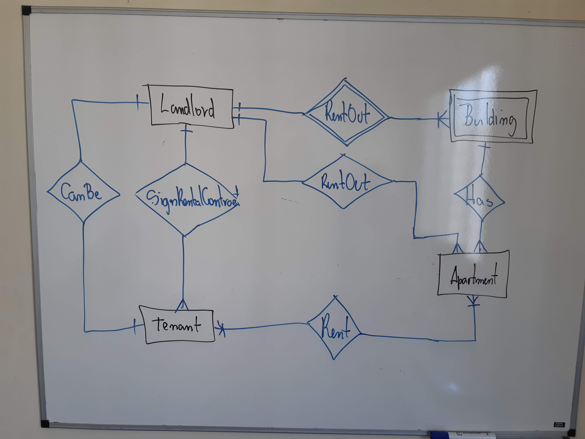
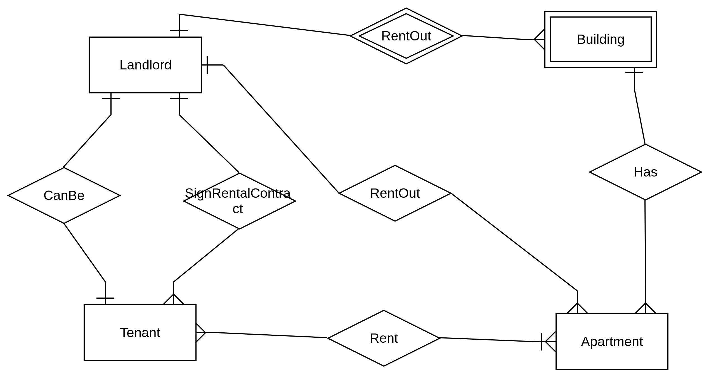

#Task 1: Domain Modelling
Please create the domain model for the following use cases:
1) A landlord can rent out a separate apartment, the whole building or several apartments to another party.
2) A landlord can sign a rental contract with one or multiple tenants.
3) One tenant can rent multiple apartments from the same landlord.
4) One tenant can rent multiple apartments simultaneously.
5) A landlord can also be a tenant of another landlord.

We suggest ER diagram as an outcome of this task but you can choose a format that makes more sense for you.

##Solution

First, I draw the big picture. [Image01](20180722_105708.jpg)

Second, I expanded to a class diagram. [Image02](20180722_111905.jpg)

Finally, I draw a entity relationship diagram [Image03](20180722_123619.jpg) [Image04](erdplus-diagram.png)

Draft

erdplus.com

